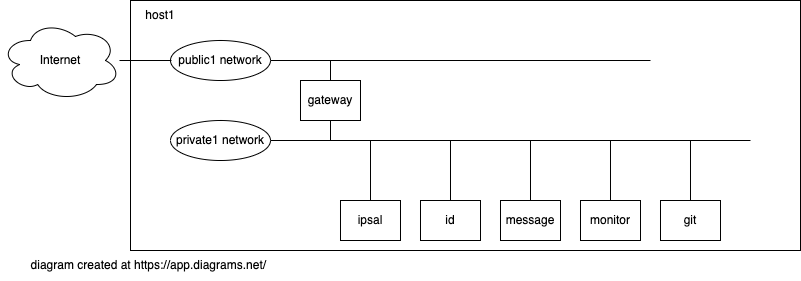

= Ansible playbook for turning a PC into a set of core service VMs

Ansible helps me build my home lab. 
This playbook turns a PC running RHEL 9 into a hypervisor running a pile-load (that's the technical term) of Virtual Machines. 
Each VM runs a set of services that support my home lab. 

. *gateway* hosts Bind and Squid
. *ipsal* (Internet Protocol Services, Application Level) hosts DHCPd and NTPd
. *id* hosts Red Hat IDM (LDAP, CA, DNS)
. *message* hosts Postfix
. *monitor* hosts Prometheus, Grafana, and Elastic
. *git* hosts Gitlab

Under construction. Sections marked with !!! and ??? are notes to self. 

If you can read Ansible's YAML, start with   
https://github.com/nickhardiman/ansible-playbook-core/blob/main/main.yml[main.yml]. 

This playbook relies on a bunch (that's another technical term) of collections, including my https://github.com/nickhardiman/ansible-collection-platform[ansible-collection-platform].
Check out requirements.yml, described below.

==  requirements 

Various roles and collections. 
See the cheatsheet below. 

== the KVM/QEMU hypervisor 

A bootstrap shell script kicks off the install. 
See instructions in 
https://github.com/nickhardiman/ansible-playbook-core/blob/main/bootstrap.sh[bootstrap.sh].

== VMs 

 

The https://github.com/nickhardiman/ansible-playbook-core/blob/main/group_vars/all/main.yml[defaults file] defines a lot of values. 
For instance, most 
MAC addresses are set to ** 52:54:00:11:00:* **,  and 
IPv4 addresses are set to ** 192.168.11.* **. 
Check out DHCP's 
https://github.com/nickhardiman/ansible-collection-platform/blob/main/roles/dhcp_server/templates/dhcpd.conf.j2[config].

.guests attached to bridges
[%header,format=csv]
|===
name,         interface, MAC,               IP,              domain
*netpublic0*,    *brpublic0*,    52:54:00:10:00:01, (IPv4 address chosen by the home router),     home
host,      enp1s0,    52:54:00:10:00:02 (!!! failed to override real address), (another address from the home router's pool),     home
gateway,      enp1s0,    52:54:00:10:00:03, (another address from the home router's pool),     home

*netcore0*,  *brcore0*,   52:54:00:11:00:01, 192.168.11.1,   core.example.com
 ,           ,           52:54:00:11:00:02, 192.168.11.2,   core.example.com
gateway,      enp2s0,    52:54:00:11:00:03, 192.168.11.3,   core.example.com
ipsal,        enp1s0,    52:54:00:11:00:04, 192.168.11.4,   core.example.com
id,           enp1s0,    52:54:00:11:00:05, 192.168.11.5,   core.example.com
message,      enp1s0,    52:54:00:11:00:06, 192.168.11.6,   core.example.com
monitor,      enp1s0,    52:54:00:11:00:07, 192.168.11.7,   core.example.com
git,          enp1s0,    52:54:00:11:00:08, 192.168.11.8,   core.example.com
|===

=== Libvirt definition files 

Each new VM is defined by libvirt config. 
An XML file for each new VM is stored in /root/libvirt/ on the hypervisor. 

[source,shell]
....
[root@host libvirt]# cat gateway.core.example.com.xml 
<domain type='kvm'>
  <name>gateway.core.example.com</name>
  <uuid>e8ac5629-37e7-443b-946e-373b60adc84d</uuid>
  <metadata>

...hundreds of lines...

    </rng>
  </devices>
</domain>
....

=== CA certificate and key 

!!! Half-assed approach to PKI. 
Replace with IdM/IPA management. 

Bootstrap script creates a CA certificate with matching key. 

Role 
https://github.com/nickhardiman/ansible-collection-platform/tree/main/roles/server_cert
uses the CA certificate to update trust anchors on VMs and to create server certificates.
New server certs are stored in /etc/pki/tls/certs/. 

files 

CA private key, a password protected file on the hypervisor here. 

* /etc/pki/tls/private/ca-certificate.key

CA certificate, a file on the hypervisor here. 

* /etc/pki/ca-trust/source/anchors/ca-certificate.pem

Any point storing it here? 

* https://github.com/nickhardiman/ansible-playbook-core/blob/main/files/ca-certificate.pem

===  ansible_user public key 

Bootstrap script creates a new key pair and stuffs it into the new Ansible vault file. 

Default public key is here. 
https://github.com/nickhardiman/ansible-collection-platform/blob/main/roles/libvirt_machine_kickstart/defaults/main.yml#L88

[source,shell]
....
user_ansible_public_key: |
  ssh-rsa AAA...YO0= pubkey for ansible
....

It should be sourced from the new ansible_user account. 

=== the gateway VM has an IPv4 address from your home network

If you know how IP address pool allocation works on your home router, 
you can fix the IP address of the gateway VM.
Not compulsory, but may help you SSH to it more easily. 

Change your DHCP service to dish out this IP address to the 
https://github.com/nickhardiman/ansible-playbook-core/blob/main/group_vars/all/main.yml#L9 and https://github.com/nickhardiman/ansible-playbook-core/blob/main/host_vars/gateway.core.example.com/main.yml#L18[MAC address]. 

!!! IP address here is not used: 
https://github.com/nickhardiman/ansible-playbook-core/blob/main/host_vars/gateway.core.example.com/main.yml#L21
Write something that copies a dynamically allocated IPv4 address from gateway to config. 

== cheat sheet

=== PC and OS

Start with a machine running RHEL 9. 
A fresh minimal install is fine. 

Only tested on a box with one ethernet interface, plugged into the network.

=== edit inventory

Set up these hosts in the inventory file inventory.ini. 

*  install_host - where the playbook runs. Might be your workstation, or might be the hypervisor host, or might be another machine in your lab.  
*  hypervisor - the physical machine that hosts the virtual machines. 

=== edit the bootstrap script

Script 
https://github.com/nickhardiman/ansible-playbook-core/blob/main/bootstrap.sh[bootstrap.sh] 
sets up everything on a freshly installed host. 
Or at least it does when I haven't improved things
(for "improved", read "broken").

I lightly tested this with RHEL and Fedora. 
Some things, like that "dnf install" line, won't work on other OSs.

* Log into the hypervisor machine.
* Download the script.

[source,shell]
....
curl -O https://raw.githubusercontent.com/nickhardiman/ansible-playbook-core/main/bootstrap.sh 
....

* Read the script 
* Follow the instructions and edit the script.

==== set an API token

After the hypervisor is installed, the role 
https://github.com/nickhardiman/ansible-collection-platform/tree/main/roles/iso_rhel_download[iso_rhel_download] 
downloads a RHEL 9.2 ISO file. 
The role uses one of the 
https://access.redhat.com/articles/3626371[Red Hat APIs], which requires an API token. 

* Open the API token page. https://access.redhat.com/management/api
* Click the button to generate a token.
* Copy the token.
* Paste the token into an environment variable.
[source,shell]
....
export OFFLINE_TOKEN=eyJh...(about 600 more characters)...xmtyM
....

Don't use an automation hub token from
https://console.redhat.com/ansible/automation-hub/token.

==== add Red Hat Subscription account to the vault

Each new VM will connect to the RHSM (Red Hat Subscription Management) network,
register, attach a subscription entitlement, and download from 
Red Hat's CDN (Content Delivery Network).

* Sign up for free at https://developers.redhat.com/.
* Check your account works by logging in at https://access.redhat.com/.
* Edit the vault file.
* Enter your Red Hat Subscription Manager account.
* Encrypt the file.

[source,shell]
....
cp vault-credentials-plaintext.yml ~/vault-credentials.yml
vim ~/vault-credentials.yml
echo 'my vault password' >  ~/my-vault-pass
ansible-vault encrypt --vault-pass-file ~/my-vault-pass ~/vault-credentials.yml  
....

=== run the bootstrap script 

* Run the script. 

The script creates a new user named _ansible_user_
along with a key pair named _ansible-key.priv_ and _ansible-key.pub_ 
and sudoers privilege escalation.
The playbook uses _ansible_user_ to connect to all the machines, 

The script also clones the playbook repo and installs dependencies. 

[source,shell]
....
bash -x bootstrap.sh
....

=== run, the AAP1 way

Build the network and machines.

Option --vault-pass-file is required when a new virtual machine gets registered to RHSM. 

[source,shell]
....
ansible-playbook  --vault-pass-file ~/my-vault-pass  main.yml
....

Or override your RHSM values. 

!!!  now auto-attach instead of   --extra-var="rhsm_pool_id=my_pool_id"

[source,shell]
....
sudo ansible-playbook main.yml \
    --extra-var="rhsm_user=my_user"  \
    --extra-var='rhsm_password=my_password' 
....

Or build just one machine and change a few details. 

[source,shell]
....
sudo ansible-playbook machine-dhcp.yml \
    --extra-var="host=another-name"  \
	  --extra-var="disk_size=40"   \
	  --extra-var="if1_mac=52:54:00:12:34:56"
....

Or install RHEL 8, not 9.

[source,shell]
....
sudo ansible-playbook machine-id.yml  \
    --extra-var="os_variant=rhel8.5"  \
    --extra-var="install_iso=/var/lib/libvirt/images/rhel-8.6-x86_64-dvd.iso"
....

=== run, the AAP2 way

Create

required?
  --playbook-artifact-enable=false \

[source,shell]
....
ansible-navigator run main.yml \
  --become-password-file=~/my-pass \
  --mode=stdout \
  --extra-var='rhsm_user=RH_user'  \
  --extra-var='rhsm_password=RH_password' \
  --extra-var='rhsm_pool_id=12345'  
....

=== check the VM console 

The OS takes a couple minutes to install on a new VM. 
You can't see much from the playbook output - each playbook exits when the build starts.

Use virsh to see what's happening.

[source,shell]
....
sudo virsh list -all
sudo virsh console gateway.core.example.com
....

A fresh kickstart install takes about 5 minutes, then the VM is powered down. 

If you want to login to the console, two accounts are configured. 

* user: root, password: Password;1
* user: nick, password: Password;1

== License

MIT

== Author Information

Nick.

